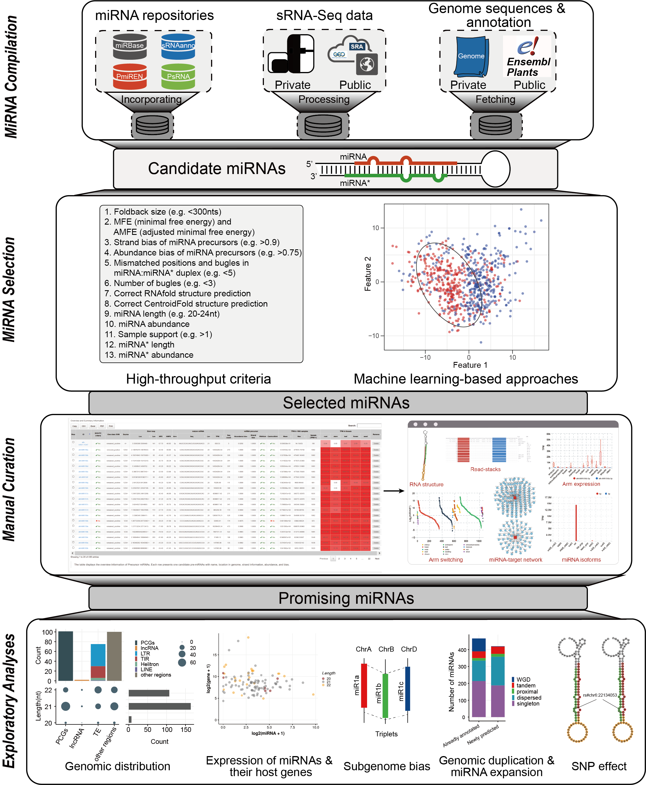

# iwa-miRNA:  A Web-based Platform for Interactive Annotation of Plant MiRNAs

   

- iwa-miRNA allows users to generate a comprehensive collection of miRNA candidates, and to interrogate miRNA annotation in a straightforward way, without the need for computational skills.

- iwa-miRNA Docker image is available at https://hub.docker.com/r/malab/iwa-mirna. Source codes and user manual are available at https://github.com/cma2015/iwa-miRNA. The web server of iwa-miRNA is accessible at http://iwa-miRNA.omicstudio.cloud/.

- The iwa-miRNA is composed with three functional modules: MiRNA Compilation, MiRNA Selection, and Manual Curation. It also provides users with some useful tools for downstream exploratory analysis. More details regarding these functional modules can be found [here](https://github.com/cma2015/iwa-miRNA/blob/master/Tutorials/Modules.md).

## How to use iwa-miRNA

- Tutorial for iwa-miRNA: http://iwa-miRNA.omicstudio.cloud/static/assets/html/index.html
- Test datasets referred in the tutorials for iwa-miRNA: https://github.com/cma2015/iwa-miRNA/tree/master/Test_data

## Abbreviations in iwa-miRNA

- SVM: support vector machine;
- HT criteria: high-throughput criteria;
- PsRNA: [plant small RNA genes](http://plantsmallrnagenes.science.psu.edu/);
- MFE: minimal free energy;
- AMFE: adjusted minimal free energy;
- sRNA-Seq: small RNA sequencing.

## Changelog

- 2020-11-30: Update the description of output results in the tutorial.
- 2020-06-24: A demo server of iwa-miRNA was released for users running small RNA sequencing datasets.
- 2020-06-20: Source codes and Docker image of iwa-miRNA were released for the first time.

## How to access help

- For any feedback and tool suggestions, please feel free to leave a message at Github [issues](https://github.com/cma2015/iwa-miRNA/issues). We will try our best to deal with all issues as soon as possible.
- In addition, if any suggestions are available, feel free to contact: **Ting Zhang** [zting135@gmail.com](mailto:zting135@gmail.com) or **Chuang Ma** [chuangma2006@gmail.com](mailto:chuangma2006@gmail.com)

## Citation

T. Zhang, J. Zhai, X. Zhang, L. Ling, M. Li, S. Xie, M. Song, C. Ma, Interactive Webbased Annotation of Plant MicroRNAs with iwa-miRNA, *Genomics, Proteomics & Bioinformatics* (2021), doi: https://doi.org/10.1016/j.gpb.2021.02.010
