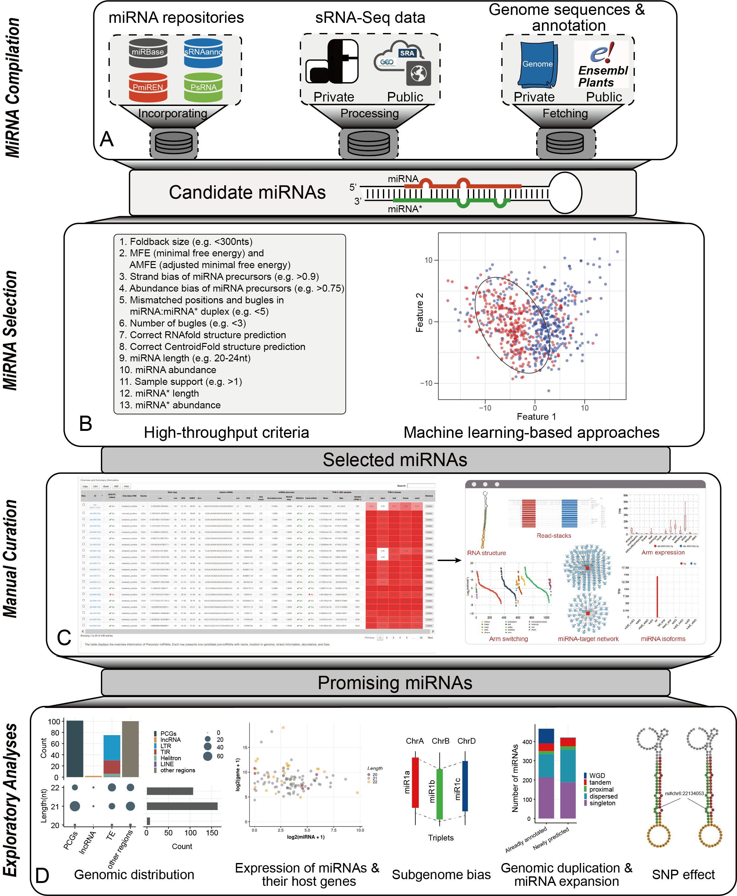

# iwa-miRNA

iwa-miRNA: Interactive web-based annotation of plant miRNAs

## Introduction

- iwa-miRNA is a valuable tool for annotation of miRNAs in plant species. It can aggregate already annotated miRNAs provided by representative miRNA repositories and newly predicted miRNAs from large-scale sRNA-Seq datasets and bridge the gap between computational analysis and manual curation. 

- iwa-miRNA is easiest to use as a web-based implementation based on Galaxy, Rmarkdown, and Docker images.

- iwa-miRNA is hosted on GitHub (https://github.com/cma2015/iwa-miRNA). The webpage of iwa-miRNA project is available at https://deepngs.nwafu.edu.cn/. We suggest users to run iwa-miRNA locally using the Docker image (https://hub.docker.com/r/malab/iwa-mirna).

### Changelog

- 2020-06-20: Source codes, web server of iwa-miRNA were released for the first time.

### How to access help

- For any feedback and tool suggestions, please feel free to leave a message at Github [issues](https://github.com/cma2015/iwa-miRNA/issues). We will try our best to deal with all issues as soon as possible.
- In addition, if any suggestions are available, feel free to contact: **Zhang Ting** [zting135@gmail.com](mailto:zting135@gmail.com) or ***Ma Chuang*** [chuangma2006@gmail.com](mailto:chuangma2006@gmail.com)

