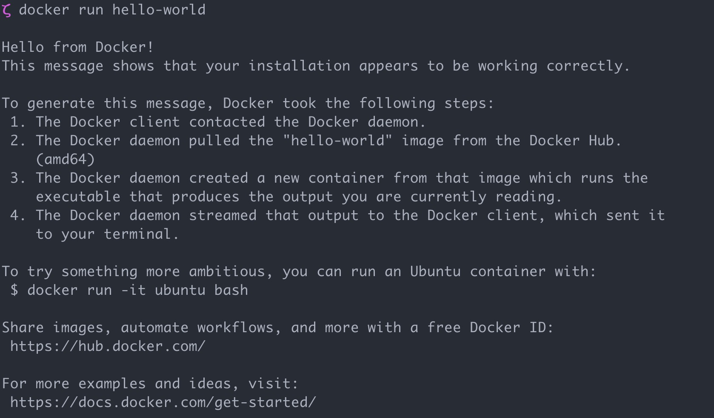

<p align="left"><a href="./User_manual.md">&#x25C0; back to Tutorial</a></p>
### Docker installation and start ([**Official installation tutorial**](https://docs.docker.com/install))

#### For Windows (Test on Windows 10 Enterprise version):
* Download [Docker](<https://download.docker.com/win/stable/Docker%20for%20Windows%20Installer.exe>) for windows </br>
* Double click the EXE file to open it;
* Follow the wizard instruction and complete installation;
* Search docker, select ___Docker for Windows___ in the search results and click it.
#### For Mac OS X (Test on macOS Sierra version 10.12.6 and macOS High Sierra version 10.13.3):
* Download [Docker](<https://download.docker.com/mac/stable/Docker.dmg>) for Mac os <br>
* Double click the DMG file to open it;
* Drag the docker into Applications and complete installation;
* Start docker from Launchpad by click it.
#### For Ubuntu (Test on Ubuntu 14.04 LTS and Ubuntu 16.04 LTS):
* Go to [Docker](<https://download.docker.com/linux/ubuntu/dists/>), choose your Ubuntu version, browse to ___pool/stable___ and choose ___amd64, armhf, ppc64el or s390x.____ Download the ___DEB___ file for the Docker version you want to install;
* Install Docker, supposing that the DEB file is download into following path:___"/home/docker-ce<version-XXX>~ubuntu_amd64.deb"___ </br>
```bash
$ sudo dpkg -i /home/docker-ce<version-XXX>~ubuntu_amd64.deb      
$ sudo apt-get install -f
```
 ### Verify if Docker is installed correctly
----------------------------------------
   Once Docker installation is completed, we can run `hello-world` image to verify if Docker is installed correctly. Open terminal in Mac OS X and Linux operating system and open CMD for Windows operating system, then type the following command:
```bash
$ docker run hello-world
```
   **<font color =red>Note</font>:** root permission is required for Linux operating system.

- Once Docker is installed successfully, you will see the following message:
  

