<div id="top"></div>

<h1>Tutorial</h1>

- [Brief introduction](#brief-introduction)
- [iwa-miRNA installation](#iwa-mirna-installation)
- [Upload data to your local iwa-miRNA server](#upload-data-to-your-local-iwa-mirna-server)
  - [Download test data](#download-test-data)
  - [Upload test data to your local iwa-miRNA server](#upload-test-data-to-your-local-iwa-mirna-server)
- [MiRNA Compilation](#mirna-compilation)
  - [miRNARetrival](#mirnaretrival)
  - [genomePrepare](#genomeprepare)
  - [miRNAPredict](#mirnapredict)
  - [miRNATranslate](#mirnatranslate)
- [MiRNA Selection](#mirna-selection)
  - [miRNASelection](#mirnaselection)
- [Manual Curation](#manual-curation)
  - [manualCuration](#manualcuration)
- [Costing time for test data](#costing-time-for-test-data)

## Brief introduction

- MicroRNAs (miRNAs), a class of short noncoding RNA, play fundamental roles in most biological processes at posttranscriptional level. The annotation of miRNA is of great importance both for supporting research in genome-scale annotation and as a foundation for functional research. 
- We present a web-based platform, iwa-miRNA, to allow generate a comprehensive collection of miRNA candidates, and interrogate miRNA annotation in a straightforward way, without the need for computational skills.
- iwa-miRNA Docker image is available at https://hub.docker.com/r/malab/iwa-mirna. Source codes and user manual are available at https://github.com/cma2015/iwa-miRNA. The web server of iwa-miRNA is accessible at https://deepngs.nwafu.edu.cn.

## iwa-miRNA installation

- **Step 1**: Docker installation

  **i) Docker installation and start ([Official installation tutorial](https://docs.docker.com/install))**

  For **Windows (Test on Windows 10 Enterprise version):**

  * Download [Docker](<https://download.docker.com/win/stable/Docker%20for%20Windows%20Installer.exe>) for windows
  * Double click the EXE file to open it;
  * Follow the wizard instruction and complete installation;
  * Search docker, select ___Docker for Windows___ in the search results and click it.

  For **Mac OS X (Test on macOS Sierra version 10.12.6 and macOS High Sierra version 10.13.3):**

  * Download [Docker](<https://download.docker.com/mac/stable/Docker.dmg>) for Mac os;
  * Double click the DMG file to open it;
  * Drag the docker into Applications and complete installation;
  * Start docker from Launchpad by click it.

  For **Ubuntu (Test on Ubuntu 18.04 LTS):**

  * Go to [Docker](<https://download.docker.com/linux/ubuntu/dists/>), choose your Ubuntu version, browse to **pool/stable** and choose **amd64, armhf, ppc64el or s390x**. Download the **DEB** file for the Docker version you want to install;
  * Install Docker, supposing that the DEB file is download into following path:___"/home/docker-ce<version-XXX>~ubuntu_amd64.deb"___ </br>

  ```bash
  $ sudo dpkg -i /home/docker-ce<version-XXX>~ubuntu_amd64.deb      
  $ sudo apt-get install -f
  ```

  **ii) Verify if Docker is installed correctly**

     Once Docker installation is completed, we can run `hello-world` image to verify if Docker is installed correctly. Open terminal in Mac OS X and Linux operating system and open CMD for Windows operating system, then type the following command:

  ```bash
  $ docker run hello-world
  ```

     **<font color =red>Note</font>:** root permission is required for Linux operating system.

  - Once Docker is installed successfully, you will see the following message:
    
    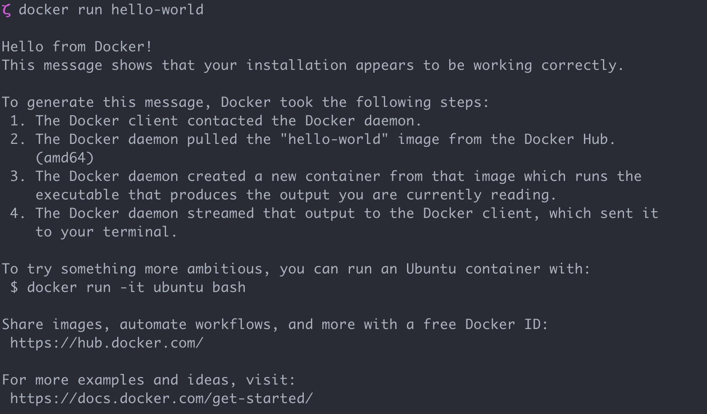

- **Step 2**: iwa-miRNA installation from Docker Hub
```bash
# pull latest iwa-miRNA Docker image from docker hub
$ docker pull malab/iwa-mirna
```
- **Step 3**: Launch iwa-miRNA local server
```bash
$ docker run -it -p 8080:8080 malab/iwa-mirna /bin/bash
$ sh /home/galaxy/run.sh
```
Then, iwa-miRNA local server can be accessed via http://localhost:8080

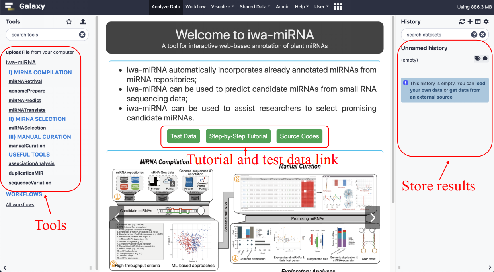

## Upload data to your local iwa-miRNA server

### Download test data

Test data for iwa-miRNA are both available at [GitHub](https://github.com/cma2015/iwa-miRNA)  and  [Web server](https://deepngs.nwafu.edu.cn). 

- **For GitHub**, click "**Clone**" (see the figure below), and then download the ZIP compressed file into your local device, and then unzip the file.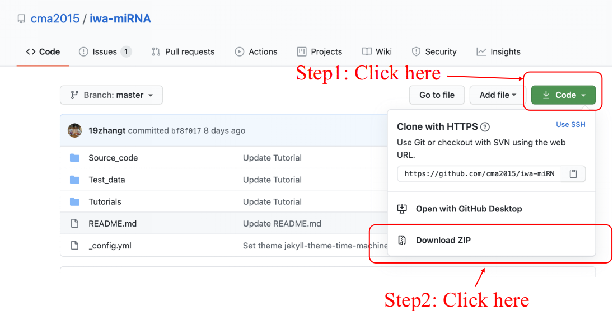

- **For web server**, click **the link** (see the figure below), and then save the file into your local device, and then unzip the file.

	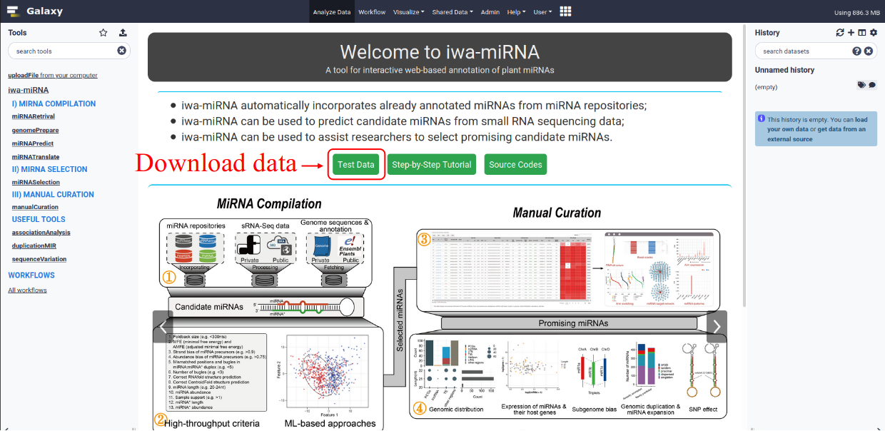
	

### Upload test data to your local iwa-miRNA server

User can upload data using `uploadFile` tool (see the figure below) in the Galaxy interface.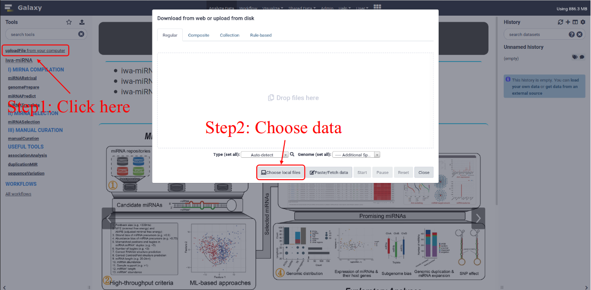 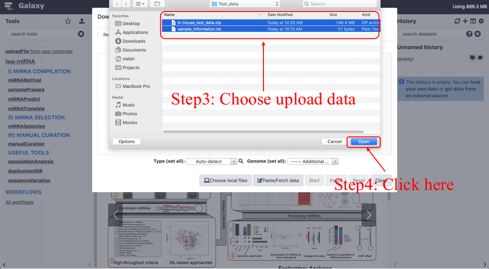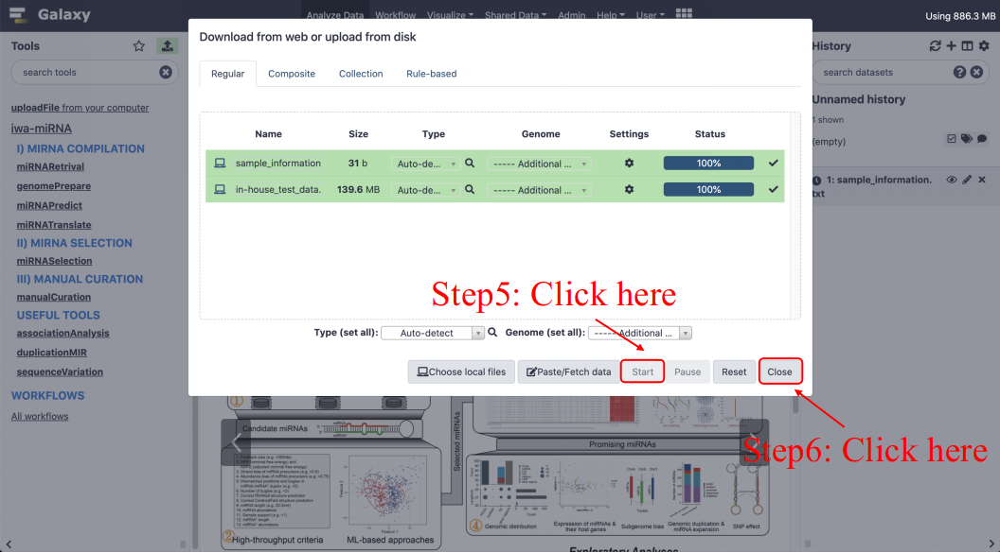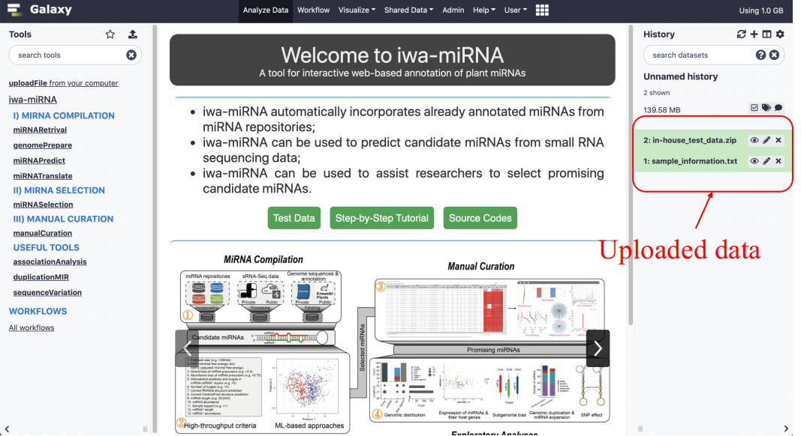 

<p align="right"><a href="#top">&#x25B2; back to top</a></p>

## MiRNA Compilation

This module generates a comprehensive collection of miRNA candidates by aggregating already annotated miRNAs from four plant miRNA databases (i.e., [miRBase](http://www.mirbase.org), [PmiREN](http://www.pmiren.com), [sRNAanno](http://plantsrnas.org), and [PsRNA](http://plantsmallrnagenes.science.psu.edu)) and predicted miRNAs from user-submitted sRNA-Seq data. In the following, we will use screenshots to show how to use this module correctly.

### miRNARetrival

This function was designed to retrieve miRNA annotations (e.g., name, sequence, genomic coordinates, and so on) automatically from four miRNA databases  ([miRBase](http://www.mirbase.org/), [PmiREN](http://www.pmiren.com/), [sRNAanno](http://plantsrnas.org/), and [Plant small RNA genes](http://plantsmallrnagenes.science.psu.edu/)). Users only need to select a species (e.g., ***Arabidopsis thaliana***) and sRNA databases (e.g., miRBase, PmiREN, sRNAanno and PlantsmallRNAgenes), then click `Execute` button to run this function (see following figure)
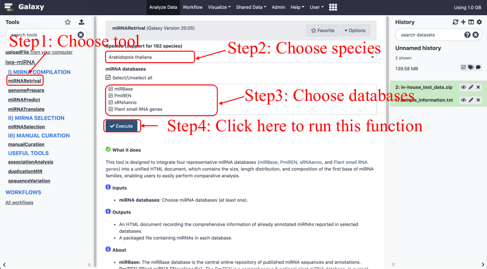
Then an interactive HTML document will be returned to users, the example output for this function is available at [here](https://deepngs.nwafu.edu.cn/static/assets/Test_results/Overview.html), the following figure shows a screenshot for the output of this function.
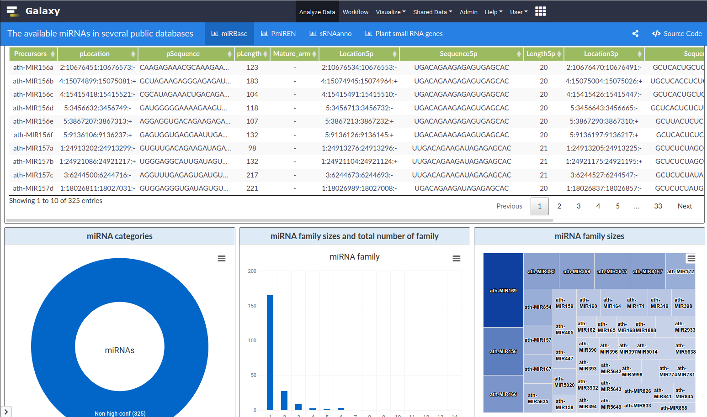

### genomePrepare

This function was designed to fetch genome sequences in FASTA format and corresponding annotations in GFF3/GTF format automatically, and then building index for the genome sequences. To run this function, users can choose **Download from EnsemblPlants database** or **Upload from local disk**:

- For **species included in EnsemblPlants database**, users choose **Download from EnsemblPlants database**, and genome sequences and corresponding annotation files will be automatically downloaded from Ensembl Plants with user-specific version. We take ***Arabidopsis thaliana*** as an example to show how to use this function (see following figure):
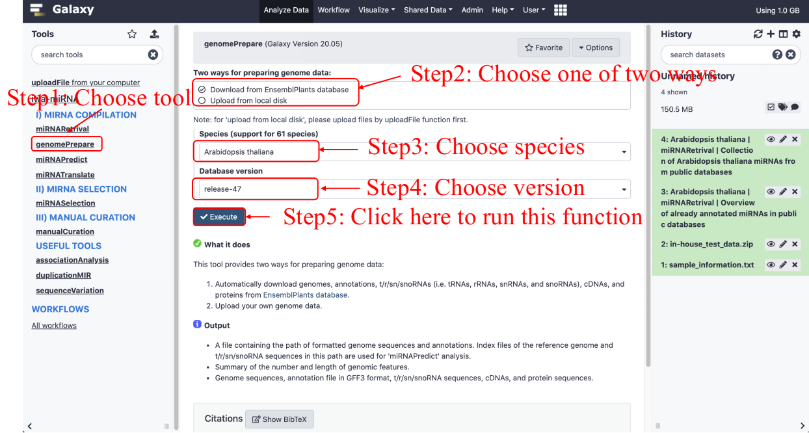
- For **species not included in EnsemblPlants**, users are required to input the Latin species name and  upload required data from local disk (see following figure).
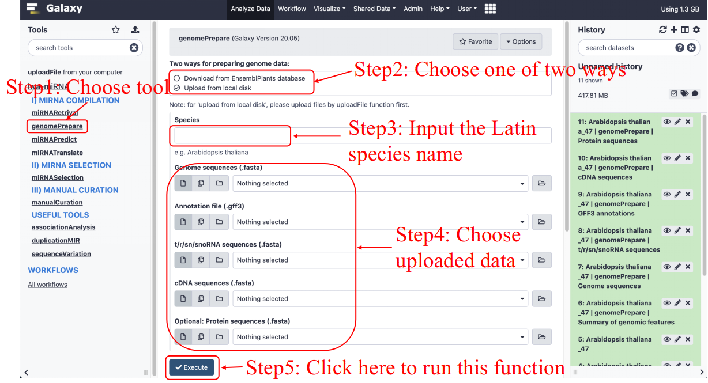

<p align="right"><a href="#top">&#x25B2; back to top</a></p>

### miRNAPredict

This function predict miRNAs from raw small RNA sequencing data, which includes download and filter raw sRNA sequencing data automatically from NCBI SRA (Short Read Archive) database and/or private datasets. 

Users are required to input the SRA accession number or upload compressed raw sequencing data (fq.gz) in ZIP format (see following figure), the sequencing data used in this tutorial are listed in `Test_data/in-house_test_data.zip`

- 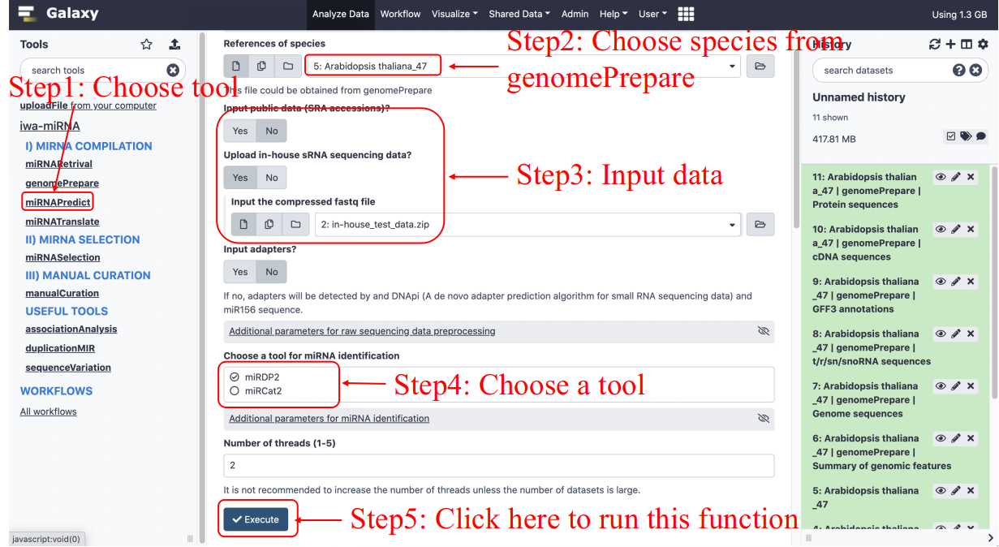
  **Note**: iwa-miRNA can automatically search for adapter sequences, but for large-scale data processing, **we recommend that users provide adapter sequences to prevent erroneous results**.
  

HTML documents and prediction results will be returned:
  **i)** Quality control report generated by  [multiQC](https://multiqc.info/)
	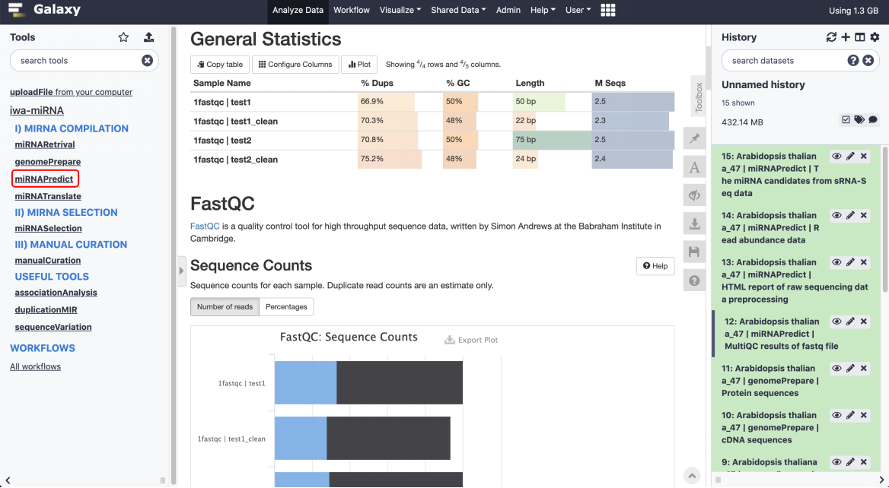
  **ii)** An HTML document recording a summary table and line chart of the number of reads in data processing will be returned (see the figure below).
  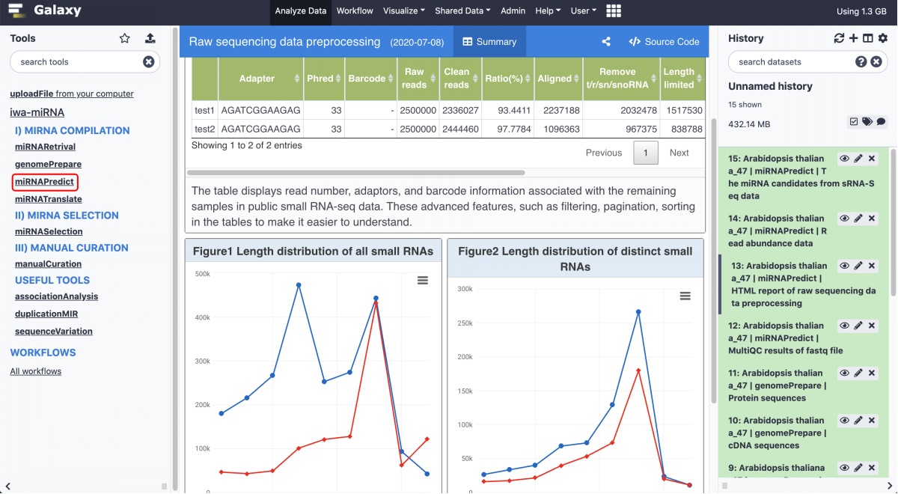
  **iii)** A file containing the location, sequences, length of miRNA candidates, miRNA precursors, 5' arm, and 3'arm (see the figure below). We also provided a complete preview of the results ([Output in miRNAPredict](https://deepngs.nwafu.edu.cn/static/assets/Test_results/miRNAPredict_output.txt)).

  


<p align="right"><a href="#top">&#x25B2; back to top</a></p>

### miRNATranslate

**miRNATranslate** can be used to translate annotated miRNAs into the genomic coordinate system of the target genome by performing miRNA precursor-to-genomic alignment using GMAP. This function takes miRNA candidates from **miRNARetrival** and **miRNAPredict** as inputs (see following figure) and outputs a TAB separated matrix with 12 columns: the location, sequence, length of miRNA precursor, 5' arm, 3'arm, the arm of mature miRNA, and miRNA source.
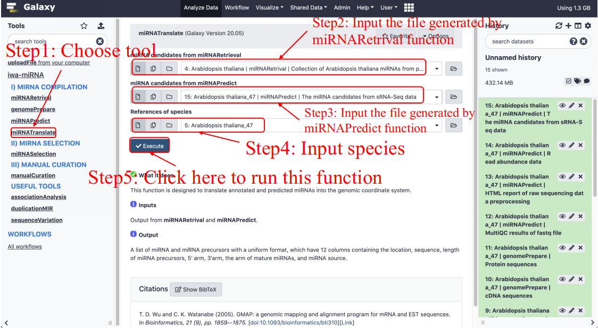
Then the miRNA candidates will be returned as a TAB separated matrix (see following figure)
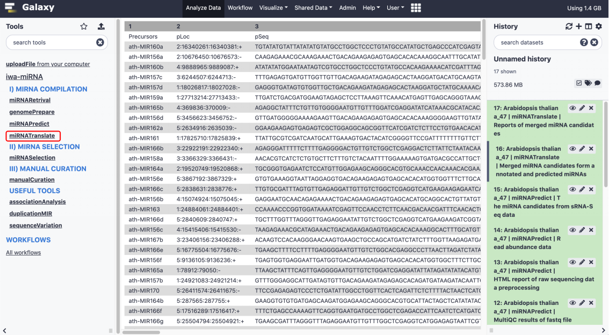

**Note:** the complete preview of this results are available at [Output in miRNATranslate](https://deepngs.nwafu.edu.cn/static/assets/Test_results/miRNATranslate_output.txt).

In addition, an HTML document recording the merged miRNAs and the RNA secondary structure plot of miRNA precursors will be returned (see the figure below). Users can make a further decision based on their knowledge through flexible operations, such as adjusting thresholds of filters, and selecting and deleting miRNA candidates. The web server provides a complete preview of the results ([Output2 in miRNATranslate](https://deepngs.nwafu.edu.cn/static/assets/Test_results/Aggregation.html)).
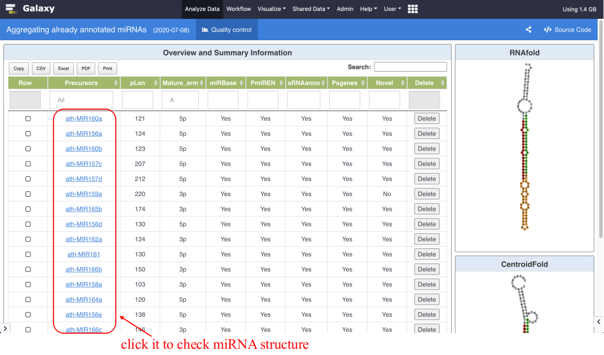

<p align="right"><a href="#top">&#x25B2; back to top</a></p>

## MiRNA Selection

This module selects a subset of miRNA candidates that are regarded as promising miRNAs, according to the high-throughput criteria and/or using an ML-based approach. For the latter miRNA selection approach, iwa-miRNA builds a one-class SVM classifier to predict if tested miRNA candidates are potentially real miRNAs or not. iwa-miRNA is user friendly, in that users can tune corresponding parameters according to the sRNA-Seq data at hand. A set of default parameters, derived from our own analysis experience, are also provided to assist non-expert users within their analyses.

### miRNASelection

To run this function, two inputs are required:
- A comprehensive collection of miRNA candidates from **miRNATranslate**
- Read sequences and expression levels from **miRNAPredict**
For other selections, see the following figure:
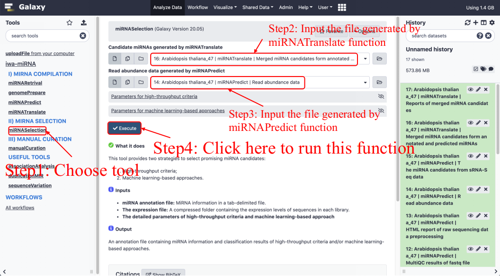

Then the annotation file containing the information of miRNA precursors , mature miRNAs and the classification results will be returned. For complete preview of this output, please refer to [Output in miRNASelection](https://deepngs.nwafu.edu.cn/static/assets/Test_results/miRNASelection_output.txt), the following figure shows a screenshot for the output.
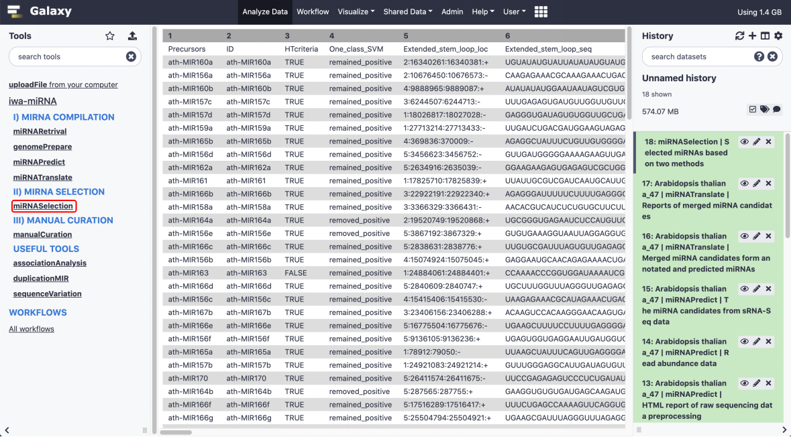


- **Note**: we have renamed the newly predicted miRNA with a uniform naming scheme and the already annotated miRNA from databases still use the previous names. The final name was included in the **ID** column.


<p align="right"><a href="#top">&#x25B2; back to top</a></p>

## Manual Curation

This module provides the information for all miRNA candidates generated during the compilation and selection processes, and creates a summary page for rapid curation of the quality of selected miRNAs.

### manualCuration

This function requires three inputs:
- Sample information: upload the data in directory `Test_data/sample_information.txt` to your local server
- (Optional) Gene description
- miRNA candidates output by **miRNASelection** 
For other options, please see the following figure:
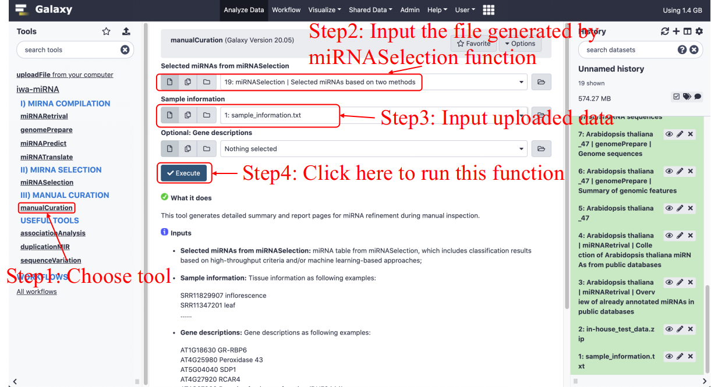

Then, the summary and report pages containing the information of miRNA precursors and mature miRNAs will be returned (see the figure below). Users can make a further decision based on their knowledge through flexible operations, such as adjusting thresholds of filters, and selecting and deleting miRNA candidates. The complete preview of the results are available at [Output in manualCuration](https://deepngs.nwafu.edu.cn/static/assets/Test_results/manualCuration_output.html).

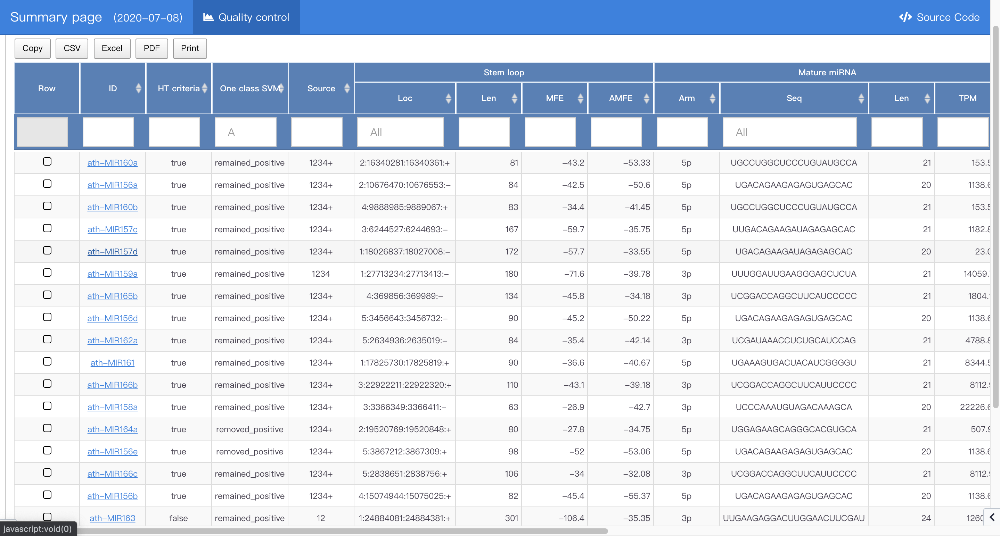

Each miRNA has a report page that contains detailed information customized by feature types, making it easy to understand this miRNA during manual curation. A secondary structure plot is generated to display the location of a mature miRNA within the precursor sequence and quality-profiling results. Read stacks are plotted to show the read support of identified miRNAs. A boxplot is used to visualize miRNA expression patterns and arm selection events across different samples. A bipartite network is constructed to depict miRNA-target interactions predicted by [psRNAtarget](http://plantgrn.noble.org/psRNATarget/). Users can quickly browse this miRNA and further decide which features make this miRNA candidate not actually a *bona fide* miRNA.

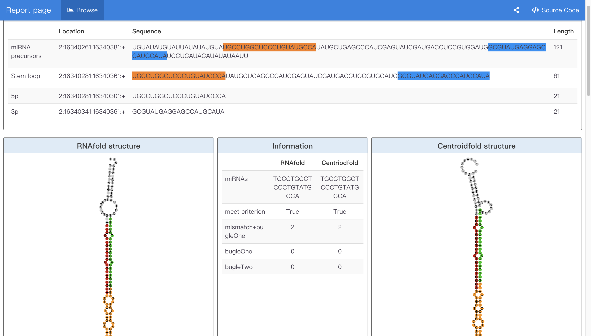

<p align="right"><a href="#top">&#x25B2; back to top</a></p>

## Costing time for test data

|                    | Costing time                             |
| ------------------ | ---------------------------------------- |
| **miRNARetrival**  | 48 seconds                               |
| **genomePrepare**  | 17 seconds                               |
| **miRNAPredict**   | 12.2 minutes (test data and two threads) |
| **miRNATranslate** | 10.03 minutes                            |
| **miRNASelection** | 3.92 minutes                             |
| **manualCuration** | 15.92 minutes                            |


