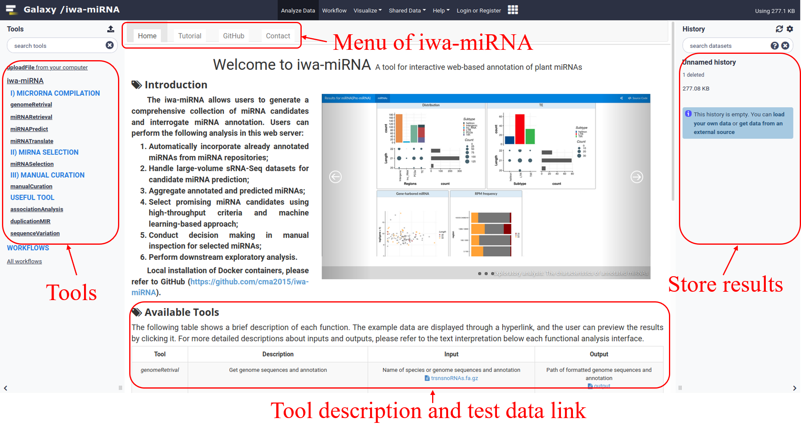
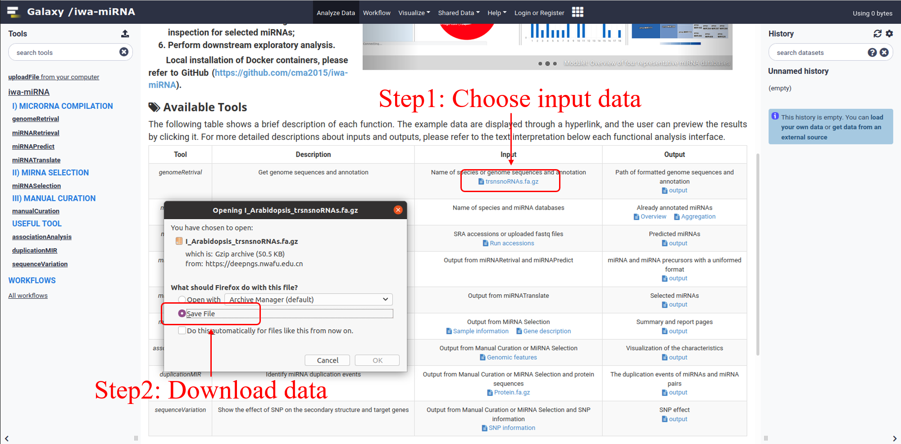
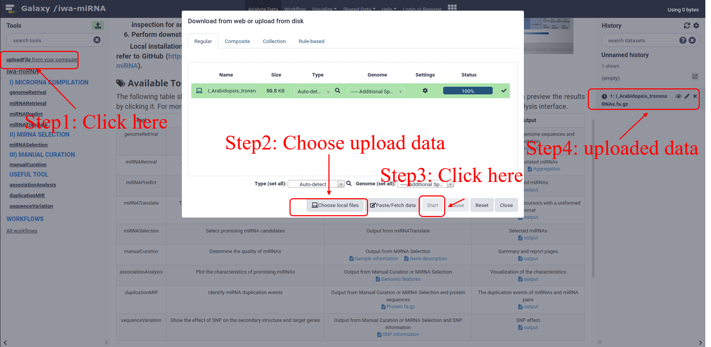
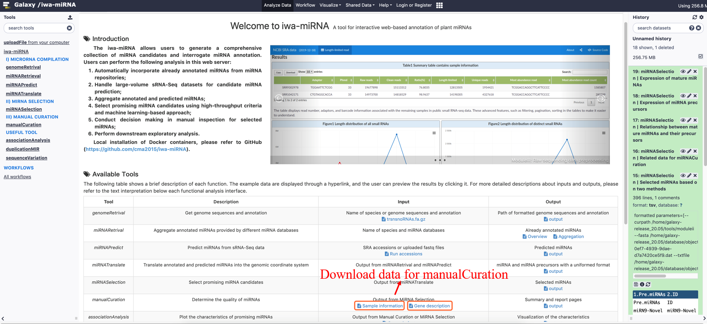

<h1>Tutorial</h1>
[TOC]

## Brief introduction

- MicroRNAs (miRNAs), a class of short noncoding RNA, play fundamental roles in most biological processes at posttranscriptional level. The annotation of miRNA is of great importance both for supporting research in genome-scale annotation and as a foundation for functional research. We present iwa-miRNA which establishes linkages between already annotations in public miRNA databases (including four existing plant databases) and new predictions from rapid accumulated sRNA-Seq data. iwa-miRNA allows users to generate a comprehensive collection of miRNA candidates, and to interrogate miRNA annotation in a straightforward way, without the need for computational skills. In addition, iwa-miRNA performs a series of accessible, reproducible, easily sharable analyses based on powerful Galaxy platform and implements interactive HTML reports for supporting decision making in manual inspection. 
- iwa-miRNA Docker image is available at https://hub.docker.com/r/malab/iwa-mirna. Source codes and user manual are available at https://github.com/cma2015/iwa-miRNA. The web server of iwa-miRNA is accessible at https://deepngs.nwafu.edu.cn.

## Docker image installation

- Step 1: [Docker installation on Windows, macOS, or Linux](https://github.com/github.com/cma2015/CAFU/blob/master/Tutorial/Docker_installation.md)

- Step 2: iwa-miRNA installation from Docker Hub  

  `docker pull malab/iwa-mirna`

- Step 3: Quickly start

  ```bash
  docker run -it -p 4000:8080 malab/iwa-mirna /bin/bash
  sh /home/galaxy-release_20.05/run.sh
  ```

Then you can access iwa-miRNA instance via http://localhost:4000

## Getting started

### The Galaxy interface of iwa-miRNA

The Galaxy interface of iwa-miRNA is separated into 3 parts. The tools list on the left, the introduction and usage of iwa-miRNA in the middle and the analysis results as history on the right. The middle interface mainly includes the home page and the tutorial page. On the homepage, there are a series of sections, such as results presentation, detailed tool descriptions, test data, useful links, etc.

### Download and upload data

User can download test data from [GitHub project](https://github.com/cma2015/iwa-miRNA) or [Web server](https://deepngs.nwafu.edu.cn/). 

- In GitHub, click "**Clone**" (see the figure below), and then download the ZIP compressed file into your local device, and then unzip the file.

- In the web server, click **the link in table** (see the figure below), and then save the file into your local device.

User can upload data using `uploadFile` tool (see the figure below) in the Galaxy interface.

## Module I

In this module, we provide detailed examples for each function to show how to obtain a comprehensive collection of miRNA candidates.

### genomeRetrival

In this function, we aim at obtain the sequence and annotation of species. In addition, the sequence indexes were built for miRNA prediction. We provide two ways for extracting the genome and related sequences and annotation (upload your own data or use built-in species). 

- **Upload your own genome:** 

  We use a list of FTP link and  t/r/sn/snoRNA.fa (GitHub: `iwa-miRNA/Test_data/I_Arabidopsis_trsnsnoRNAs.fa.gz` or web server: [data link](https://deepngs.nwafu.edu.cn/static/welcome/testData/I_Arabidopsis_trsnsnoRNAs.fa.gz))  to build index. A file containing the path of species (e.g. `Index/Arabidopsis_thaliana_XXXX`) will be returned.

- **Built-in species:** 

  We use *Arabidopsis thaliana* as a sample. A file containing the species path (e.g. `Index/arabidopsis_thaliana_47`) will be returned.

### miRNARetrival

In this function, we aim at obtain annotated miRNAs provided by different miRNA databases. We provide two ways for database research:

1. Integrating four representative miRNA databases ([miRBase](http://www.mirbase.org/), [PmiREN](http://www.pmiren.com/), [sRNAanno](http://plantsrnas.org/), and [Plant small RNA genes](http://plantsmallrnagenes.science.psu.edu/)) into a unified HTML document containing miRNA family size, length distribution, and composition of the first base, enabling users performing comparative analysis easily.

   **Input:**

   Use species and database as input and click execute to get the results.

   **Output:**

   An HTML document recording the comprehensive information of miRNAs reported in selected databases will be returned (see the figure below). The web server provides a complete preview of the results ([Output2 in miRNARetrival](https://deepngs.nwafu.edu.cn/static/welcome/testData/Test_results/I_Overview.html)).

   

2. Aggregating already annotated miRNAs provided by four representative miRNA repositories. Considering that the databases may come from different versions, the outputs can be unified by providing a genome and re-mapping using [GMAP](https://academic.oup.com/bioinformatics/article/21/9/1859/409207)). It was found that the genome versions of *Arabidopsis thaliana* in the four databases are the same from the results of previous step. Therefore, we directly aggregate the results of the four databases.

   **Output:**

   An HTML document recording the merged miRNAs and the RNA secondary structure plot of miRNA precursors was returned (see the figure below). Users can make a further decision based on their knowledge through flexible operations, such as adjusting thresholds of filters, and selecting and deleting miRNA candidates. The web server provides a complete preview of the results ([Output2 in miRNARetrival](https://deepngs.nwafu.edu.cn/static/welcome/testData/Test_results/I_Aggregation.html)).

   

### miRNAPredict

In this function, we aim at predict miRNAs from small RNA sequencing data. We provide two sections for data processing:

1. **Raw sequencing data preprocessing:** This sub-function will download and filter raw sRNA sequencing data automatically from NCBI SRA (Short Read Archive) database and/or private datasets.

   **Input:** 

   In the current version of iwa-miRNA, users can flexibly choose to fetch public data (Test data in GitHub: `iwa-miRNA/Test_data/I_miRNAPredict_input.txt` or web server: [data link](https://deepngs.nwafu.edu.cn/static/welcome/testData/I_miRNAPredict_input.txt)) and/or upload private data to iwa-miRNA. In addition, iwa-miRNA can automatically search for adapter sequences, but for large-scale data processing, we recommend that users provide adapter sequences to prevent erroneous results.

   

   **Output:** 

   1. iwa-miRNA uses [multiQC](https://multiqc.info/) to aggregate quality control results into one HTML document for inspection of data processing.

   

   2. An HTML document recording a summary table and line chart of the number of reads in data processing will be returned (see the figure below).

   

2. **miRNA identification and quantification:** This sub-function was used to predict miRNA candidates.

   **Input:** 

   The compressed fasta file from 'Raw sequencing data preprocessing' in **miRNAPredict** and path of species from **genomeRetrival** were as the input. 

   

   **Output:**

   The location, sequence, length of miRNA candidates, miRNA precursors, 5' arm, and 3'arm were returned (see the figure below). The web server provides a complete preview of the results ([Output in miRNAPredict](https://deepngs.nwafu.edu.cn/static/welcome/testData/Test_results/I_miRNATranslate_output.txt)).

   

### miRNATranslate

In this function, we aim at aggregate annotated and predicted miRNAs into the genomic coordinate system. The output of this function includes a list of miRNA candidates with 12 columns containing the location, sequence, length of miRNA precursor, 5' arm, 3'arm, the arm of mature miRNA, and miRNA source.

**Input:** 

miRNA candidates from **miRNARetrival** and **miRNAPredict**.


**Output:**

A list of miRNA candidates with 12 columns containing the location, sequence, length of miRNA precursor, 5' arm, 3'arm, the arm of mature miRNA, and miRNA source. The web server provides a complete preview of the results ([Output in miRNATranslate](https://deepngs.nwafu.edu.cn/static/welcome/testData/Test_results/I_miRNATranslate_output.txt)).


## Module II

### miRNASelection

In this function, we aim at select promising miRNA candidates using high-throughput criteria and/or machine learning-based approaches. 

**Input:** 

A comprehensive collection of miRNA candidates from **miRNATranslate**.

Read sequences and expression levels from **miRNAPredict**.


**Output:**

The annotation file containing the information of miRNA precursors and mature miRNAs and the classification results of high-throughput criteria and/or machine learning-based approach. In addition, we have renamed the newly predicted miRNA with a uniform naming scheme and the already annotated miRNA from databases still use the previous names. The final name was included in the **ID** column. The web server provides a complete preview of the results ([Output in miRNASelection](https://deepngs.nwafu.edu.cn/static/welcome/testData/Test_results/II_miRNASelection_output.txt)).


## Module III

### manualCuration

In this function, we aim at generate a detailed feature report for the convenience of miRNA refinement during manual inspection.

**Input:**

Users can download data (Test data in GitHub: `iwa-miRNA/Test_data/III_sample_information.txt` and `III_gene_description.txt`  or web server: [data1-sample_information](https://deepngs.nwafu.edu.cn/static/welcome/testData/III_sample_information.txt) and [data2-gene_description](https://deepngs.nwafu.edu.cn/static/welcome/testData/III_gene_description.txt)) as a part of input of this function.



Besides, selected miRNA candidates from **miRNATranslate** as an essential input.


**Output:**

The summary and report pages containing the information of miRNA precursors and mature miRNAs will be returned (see the figure below). Users can make a further decision based on their knowledge through flexible operations, such as adjusting thresholds of filters, and selecting and deleting miRNA candidates. The web server provides a complete preview of the results ([Output in manualCuration](https://deepngs.nwafu.edu.cn/static/welcome/testData/Test_results/III_manualCuration_output.html)).


Each miRNA has a report page that contains detailed information customized by feature types, making it easy to understand this miRNA during manual curation. A secondary structure plot is generated to display the location of a mature miRNA within the precursor sequence and quality-profiling results. Read stacks are plotted to show the read support of identified miRNAs. A boxplot is used to visualize miRNA expression patterns and arm selection events across different samples. A bipartite network is constructed to depict miRNA-target interactions predicted by [psRNAtarget](http://plantgrn.noble.org/psRNATarget/). Users can quickly browse this miRNA and further decide which features make this miRNA candidate not actually a *bona fide* miRNA. The web server provides a complete preview of the results ([Output in manualCuration](https://deepngs.nwafu.edu.cn/static/welcome/testData/Test_results/III_manualCuration_output.html)).

