<div id="top"></div>
<h1>Tutorial</h1>

- [Brief introduction](#brief-introduction)
- [iwa-miRNA installation](#iwa-mirna-installation)
- [MiRNA Compilation](#mirna-compilation)
  * [genomeRetrival](#genomeretrival)
  * [miRNARetrival](#mirnaretrival)
  * [miRNAPredict](#mirnapredict)
  * [miRNATranslate](#mirnatranslate)
- [MiRNA Selection](#mirna-selection)
- [Manual Curation](#manual-curation)

## Brief introduction

- MicroRNAs (miRNAs), a class of short noncoding RNA, play fundamental roles in most biological processes at posttranscriptional level. The annotation of miRNA is of great importance both for supporting research in genome-scale annotation and as a foundation for functional research. 
- We present a web-based platform, iwa-miRNA, to allow generate a comprehensive collection of miRNA candidates, and to interrogate miRNA annotation in a straightforward way, without the need for computational skills.
- iwa-miRNA Docker image is available at https://hub.docker.com/r/malab/iwa-mirna. Source codes and user manual are available at https://github.com/cma2015/iwa-miRNA. The web server of iwa-miRNA is accessible at https://deepngs.nwafu.edu.cn.

## iwa-miRNA installation

- **Step 1**: Docker installation

  **i) Docker installation and start ([Official installation tutorial](https://docs.docker.com/install))**

  For **Windows (Test on Windows 10 Enterprise version):**

  * Download [Docker](<https://download.docker.com/win/stable/Docker%20for%20Windows%20Installer.exe>) for windows
  * Double click the EXE file to open it;
  * Follow the wizard instruction and complete installation;
  * Search docker, select ___Docker for Windows___ in the search results and click it.

  For **Mac OS X (Test on macOS Sierra version 10.12.6 and macOS High Sierra version 10.13.3):**

  * Download [Docker](<https://download.docker.com/mac/stable/Docker.dmg>) for Mac os <br>
  * Double click the DMG file to open it;
  * Drag the docker into Applications and complete installation;
  * Start docker from Launchpad by click it.

  For **Ubuntu (Test on Ubuntu 14.04 LTS and Ubuntu 16.04 LTS):**

  * Go to [Docker](<https://download.docker.com/linux/ubuntu/dists/>), choose your Ubuntu version, browse to ___pool/stable___ and choose ___amd64, armhf, ppc64el or s390x.____ Download the ___DEB___ file for the Docker version you want to install;
  * Install Docker, supposing that the DEB file is download into following path:___"/home/docker-ce<version-XXX>~ubuntu_amd64.deb"___ </br>

  ```bash
  $ sudo dpkg -i /home/docker-ce<version-XXX>~ubuntu_amd64.deb      
  $ sudo apt-get install -f
  ```

  **ii) Verify if Docker is installed correctly**

  ----------------------------------------

     Once Docker installation is completed, we can run `hello-world` image to verify if Docker is installed correctly. Open terminal in Mac OS X and Linux operating system and open CMD for Windows operating system, then type the following command:

  ```bash
  $ docker run hello-world
  ```

     **<font color =red>Note</font>:** root permission is required for Linux operating system.

  - Once Docker is installed successfully, you will see the following message:
    

  

- **Step 2**: iwa-miRNA installation from Docker Hub
```bash
# pull latest iwa-miRNA Docker image from docker hub
$ docker pull malab/iwa-mirna
```
- **Step 3**: Launch iwa-miRNA local server
```bash
$ docker run -it -p 4000:8080 malab/iwa-mirna /bin/bash
$ sh /home/galaxy-release_20.05/run.sh
```
Then, iwa-miRNA local server can be accessed via http://localhost:4000

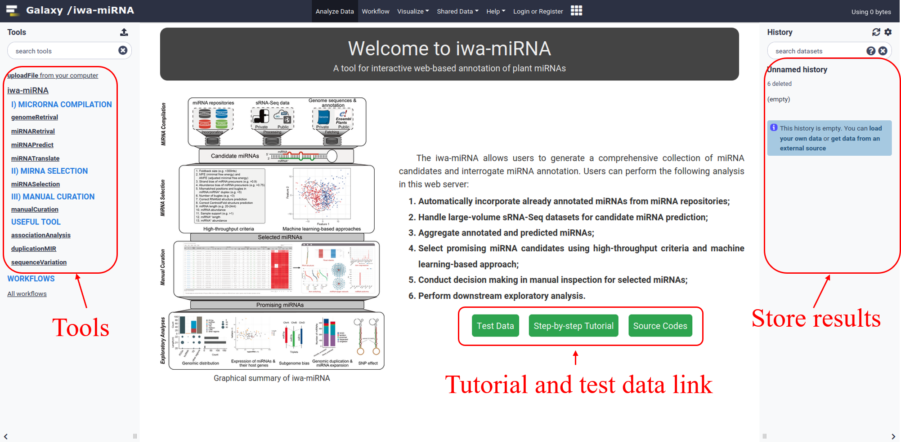

## Upload data to your local iwa-miRNA server

### Download test data

Test data for iwa-miRNA are both available at [GitHub](https://github.com/cma2015/iwa-miRNA/tree/master/Test_data)  and  [Web server](https://deepngs.nwafu.edu.cn). 

- **For GitHub**, click "**Clone**" (see the figure below), and then download the ZIP compressed file into your local device, and then unzip the file.

- **For web server**, click **the link** (see the figure below), and then save the file into your local device, and then unzip the file.

	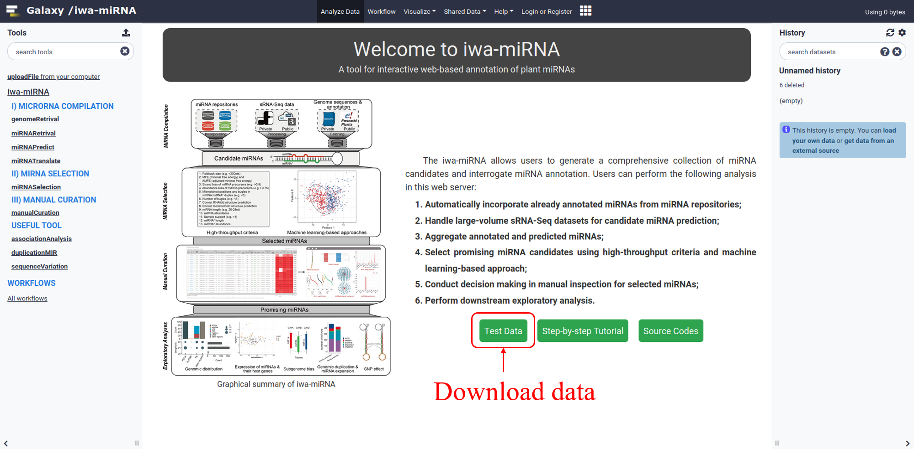
	
	A detailed list of sample data is shown below.

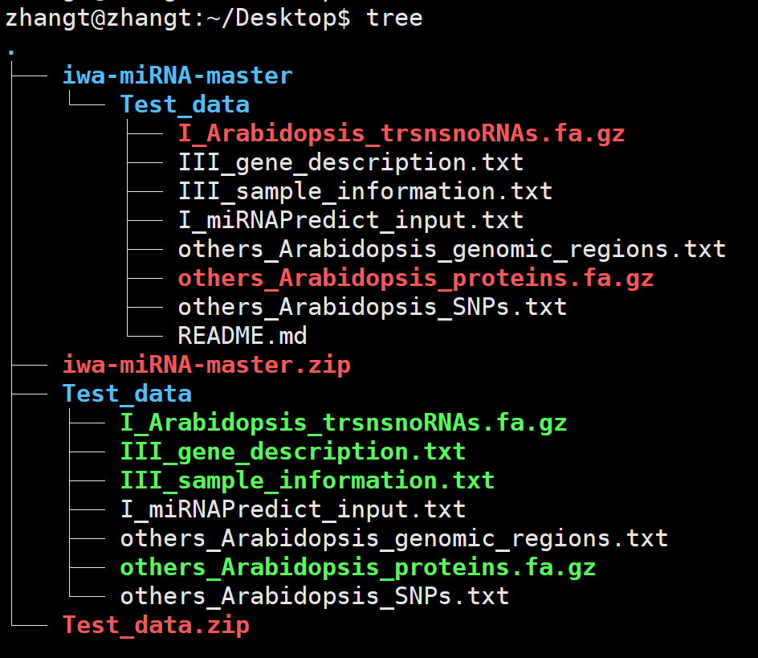

### Upload test data to your local iwa-miRNA server

User can upload data using `uploadFile` tool (see the figure below) in the Galaxy interface.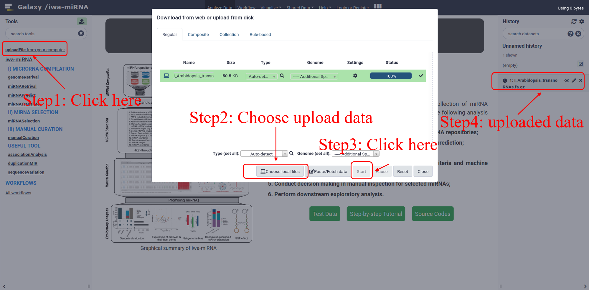

<p align="right"><a href="#top">&#x25B2; back to top</a></p>

## MiRNA Compilation

This module generates a comprehensive collection of miRNA candidates by aggregating already annotated miRNAs from four plant miRNA databases (i.e., [miRBase](http://www.mirbase.org), [PmiREN](http://www.pmiren.com), [sRNAanno](http://plantsrnas.org), and [PsRNA](http://plantsmallrnagenes.science.psu.edu)) and predicted miRNAs from user-submitted sRNA-Seq data. In the following, we will use screenshots to show how to use this module correctly.

### genomeRetrival

This function was designed to fetch genome sequences in FASTA format and corresponding annotations in GFF3/GTF format automatically, and then building index for the genome sequences. To run this function, users can choose **Upload your own genome** or **Built-in species**:

- For **Upload your own genome:** users are required to input the Latin species name and choose uploading data from FTP link (see following figure), the required input for t/r/sn/snoRNA sequences are available at `Test_data/I_Arabidopsis_trsnsnoRNAs.fa.gz`
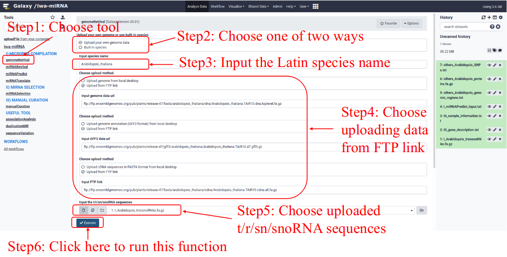

- For **Built-in species:** 
If users choose **Built-in species**, genome sequences and corresponding annotation file will be automatically downloaded from Ensembl Plants with user-specifc version, here, we take *Arabidopsis thaliana* as an example to show how to use this function (see following figure):
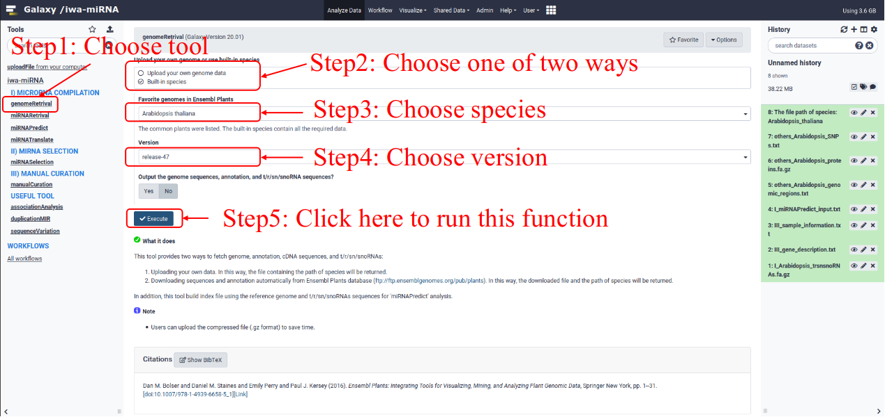

<p align="right"><a href="#top">&#x25B2; back to top</a></p>

### miRNARetrival

This function aims to retrive miRNA annotations (e.g., name, sequence, genomic coordinates, and so on) automatically from four miRNA databases  ([miRBase](http://www.mirbase.org/), [PmiREN](http://www.pmiren.com/), [sRNAanno](http://plantsrnas.org/), and [Plant small RNA genes](http://plantsmallrnagenes.science.psu.edu/)). Users can choose **Overview of four representative miRNA databases** or **Aggregating already annotated miRNAs**

- For **Overview of four representative miRNA databases**, users only need to select a species (e.g., **Arabidopsis_thaliana**) and sRNA databases (e.g., airbase, PmiREN, sRNAanno and PlantsmallRNAgenes), then click `Execute` button to run this function (see following figure)
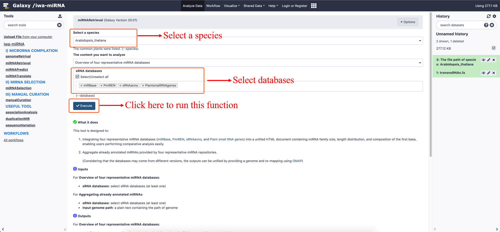
Then an interactive HTML document will be returned to users, the example output for this function is available at [here](https://deepngs.nwafu.edu.cn/static/welcome/testData/Test_results/I_Overview.html), the following figure shows a screenshot for the output of this function.
 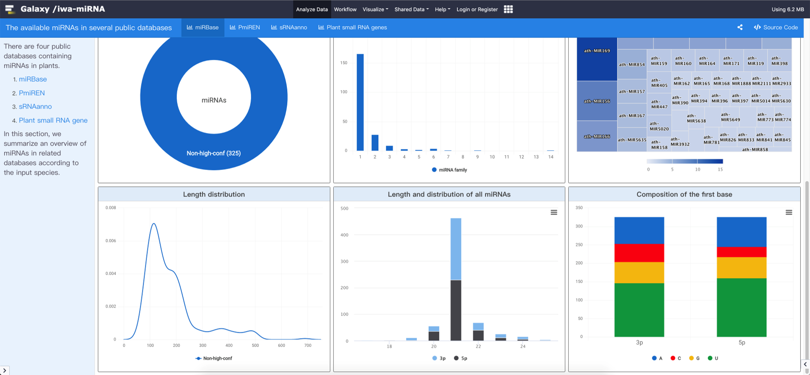

- For **Aggregating already annotated miRNAs**, this sub-function are designed to unify genome version by remapping miRNA sequences to a latest reference genome by using  [GMAP](https://academic.oup.com/bioinformatics/article/21/9/1859/409207). To run this sub-function, users are required to provide the genome index path which can be generated by function **genomeRetrival**, and then selecting the species (see following figure):
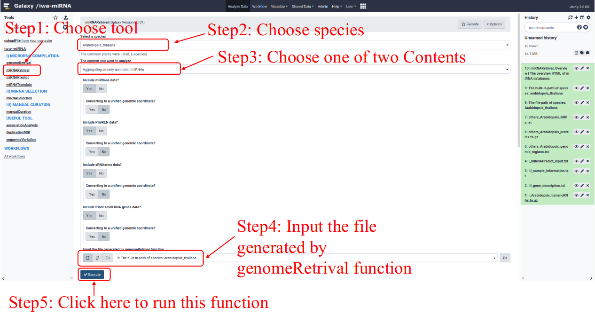

	Once finishing running,  an HTML document recording the merged miRNAs and the RNA secondary structure plot of miRNA precursors will be returned (see the figure below). Users can make a further decision based on their knowledge through flexible operations, such as adjusting thresholds of filters, and selecting and deleting miRNA candidates. The web server provides a complete preview of the results ([Output2 in miRNARetrival](https://deepngs.nwafu.edu.cn/static/welcome/testData/Test_results/I_Aggregation.html)).
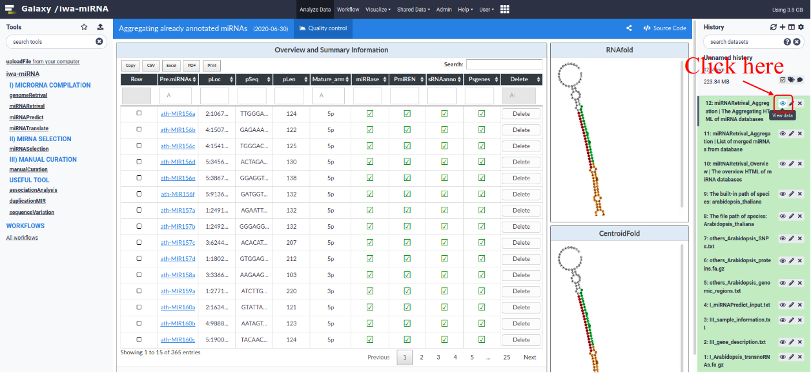

<p align="right"><a href="#top">&#x25B2; back to top</a></p>

### miRNAPredict

This function provided two sub-functions (**Raw sequencing data preprocessing** and **miRNA identification and quantification**) to predict miRNAs from raw small RNA sequencing data.

- For **Raw sequencing data preprocessing:** this sub-function will download and filter raw sRNA sequencing data automatically from NCBI SRA (Short Read Archive) database and/or private datasets. Users are required to input the SRA accession number or upload raw sequencing data in FASTQ format  (see following figure), the SRA accessions used in this tutorial are listed in `Test_data/I_miRNAPredict_input.txt`
  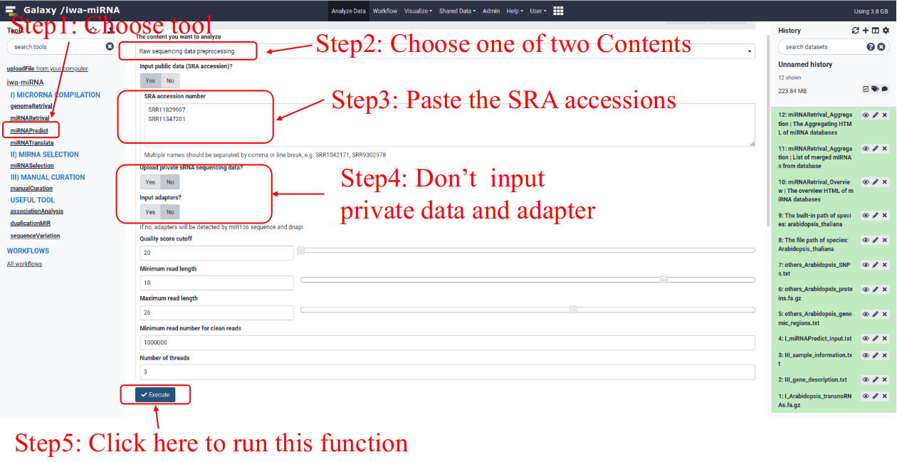
  **Note**: iwa-miRNA can automatically search for adapter sequences, but for large-scale data processing, **we recommend that users provide adapter sequences to prevent erroneous results**.

  Then two HTML documents will returned:
	**i)** Quality control report generated by  [multiQC](https://multiqc.info/)
  
  **ii)** An HTML document recording a summary table and line chart of the number of reads in data processing will be returned (see the figure below).
  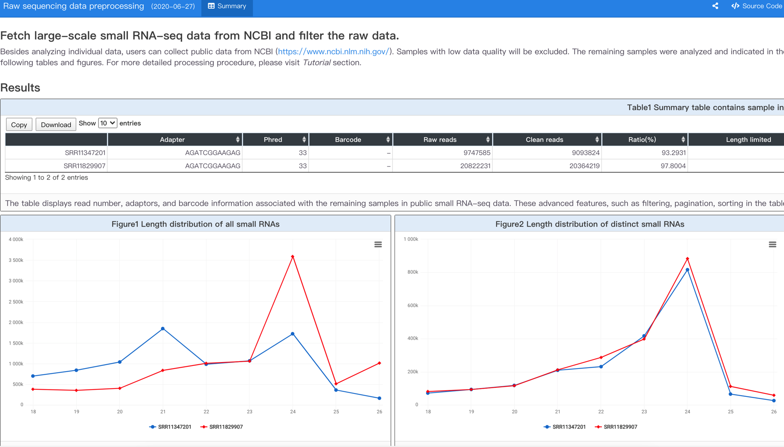

- For **miRNA identification and quantification:** this sub-function was used to predict miRNA candidates. Users are required to input the compressed fasta file (generated by last sub-function **Raw sequencing data preprocessing** in **miRNAPredict**) and the path of genome index (generated by function **genomeRetrival**) to run this sub-function.
   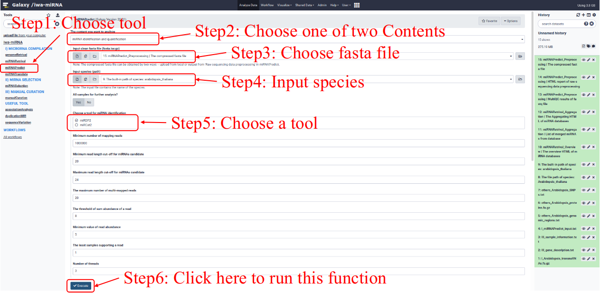
   Then, the location, sequences, length of miRNA candidates, miRNA precursors, 5' arm, and 3'arm will be returned (see the figure below). We also provided a complete preview of the results ([Output in miRNAPredict](https://deepngs.nwafu.edu.cn/static/welcome/testData/Test_results/I_miRNATranslate_output.txt)).

   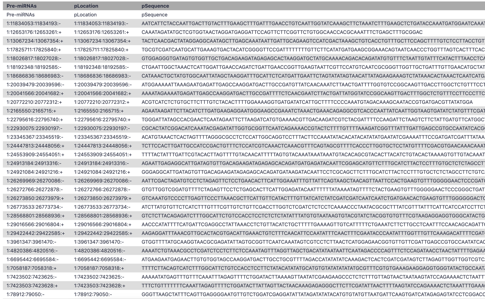

<p align="right"><a href="#top">&#x25B2; back to top</a></p>

### miRNATranslate

**miRNATranslate** can be used to translate annotated miRNAs into the genomic coordinate system of the target genome by performing miRNA precursor-to-genomic alignment using GMAP. This function takes miRNA candidates from **miRNARetrival** and **miRNAPredict** as inputs (see following figure) and outputs a TAB seperated matrix with 12 columns: the location, sequence, length of miRNA precursor, 5' arm, 3'arm, the arm of mature miRNA, and miRNA source.
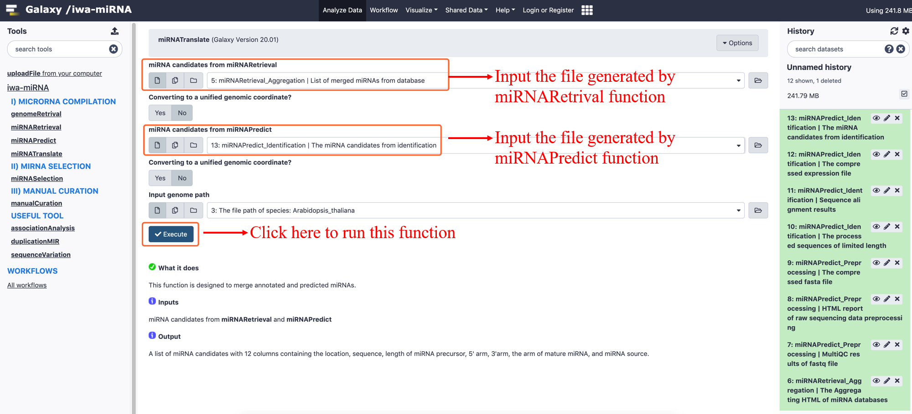
Then the miRNA candidates will be returned as a TAB seperated matrix (see following figure)
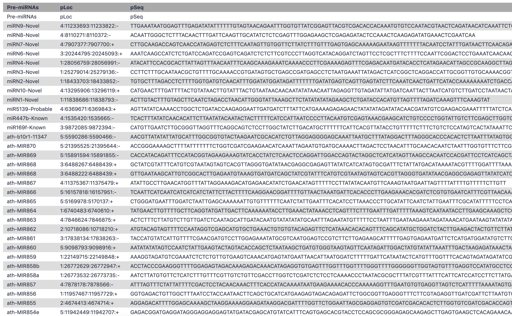

Note: the complete preview of this results are available at  [Output in miRNATranslate](https://deepngs.nwafu.edu.cn/static/welcome/testData/Test_results/I_miRNATranslate_output.txt).

<p align="right"><a href="#top">&#x25B2; back to top</a></p>

## MiRNA Selection

This module selects a subset of miRNA candidates that are regarded as promising miRNAs, according to the high-throughput criteria and/or using an ML-based approach. For the latter miRNA selection approach, iwa-miRNA builds a one-class SVM classifier to predict if tested miRNA candidates are potentially real miRNAs or not. iwa-miRNA is user friendly, in that users can tune corresponding parameters according to the sRNA-Seq data at hand. A set of default parameters, derived from our own analysis experience, are also provided to assist non-expert users within their analyses.

### miRNASelection

To run this function, two inputs are required:
- A comprehensive collection of miRNA candidates from **miRNATranslate**
- Read sequences and expression levels from **miRNAPredict**
For other selections, see the following figure:
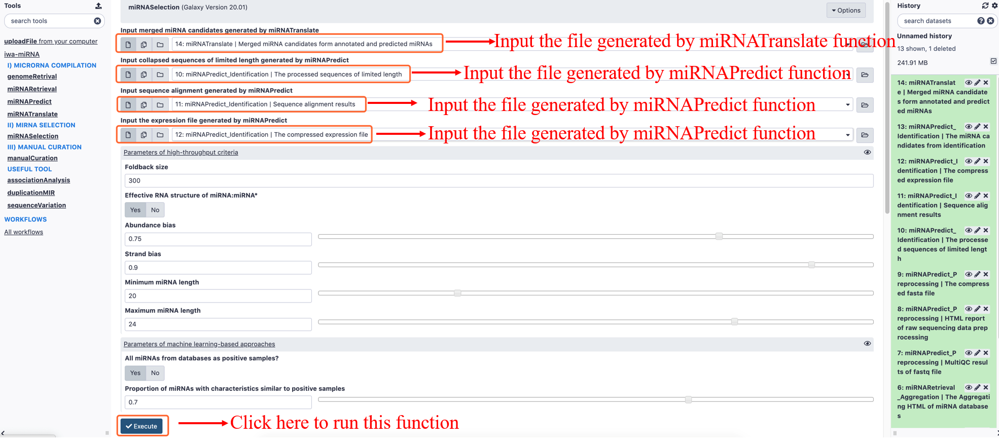

Then the annotation file containing the information of miRNA precursors , mature miRNAs and the classification results will be returned. For complete preview of this output, please refer to [Output in miRNASelection](https://deepngs.nwafu.edu.cn/static/welcome/testData/Test_results/II_miRNASelection_output.txt), the following figure shows a screenshot for the output.
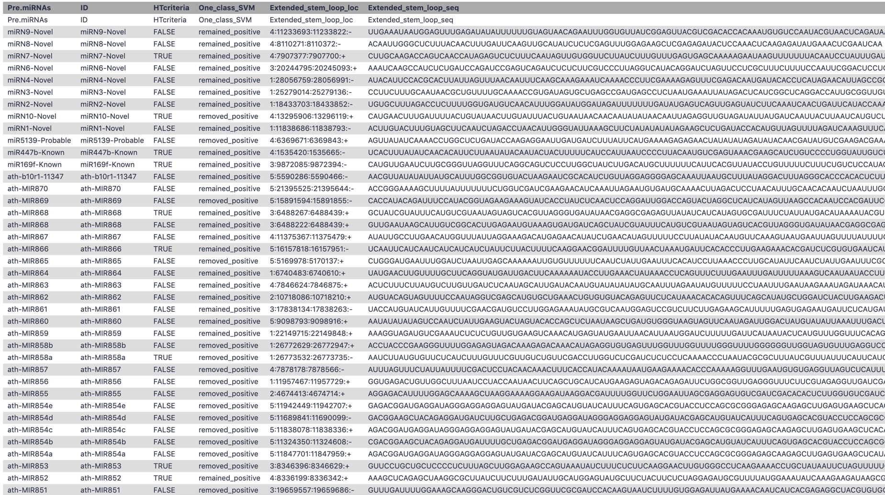


- **Note**: we have renamed the newly predicted miRNA with a uniform naming scheme and the already annotated miRNA from databases still use the previous names. The final name was included in the **ID** column.


<p align="right"><a href="#top">&#x25B2; back to top</a></p>

## Manual Curation

This module provides the information for all miRNA candidates generated during the compilation and selection processes, and creates a summary page for rapid curation of the quality of selected miRNAs.

### manualCuration

This function requires three inputs:
- Sample information: upload the data in directory `Test_data/III_sample_information.txt` to your local server
- Gene description: upload the data in directory `Test_data/III_gene_description.txt` to your local server
- miRNA candidates output by **miRNATranslate** 
For other options, please see the following figure:
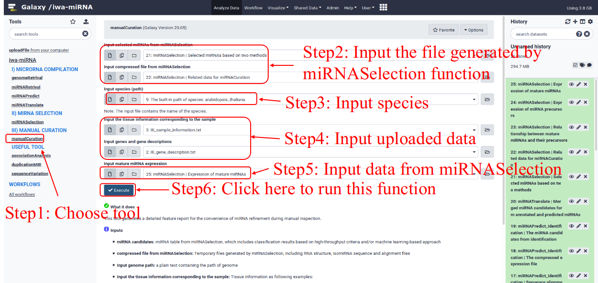

Then, the summary and report pages containing the information of miRNA precursors and mature miRNAs will be returned (see the figure below). Users can make a further decision based on their knowledge through flexible operations, such as adjusting thresholds of filters, and selecting and deleting miRNA candidates. The complete preview of the results are available at [Output in manualCuration](https://deepngs.nwafu.edu.cn/static/welcome/testData/Test_results/III_manualCuration_output.html).

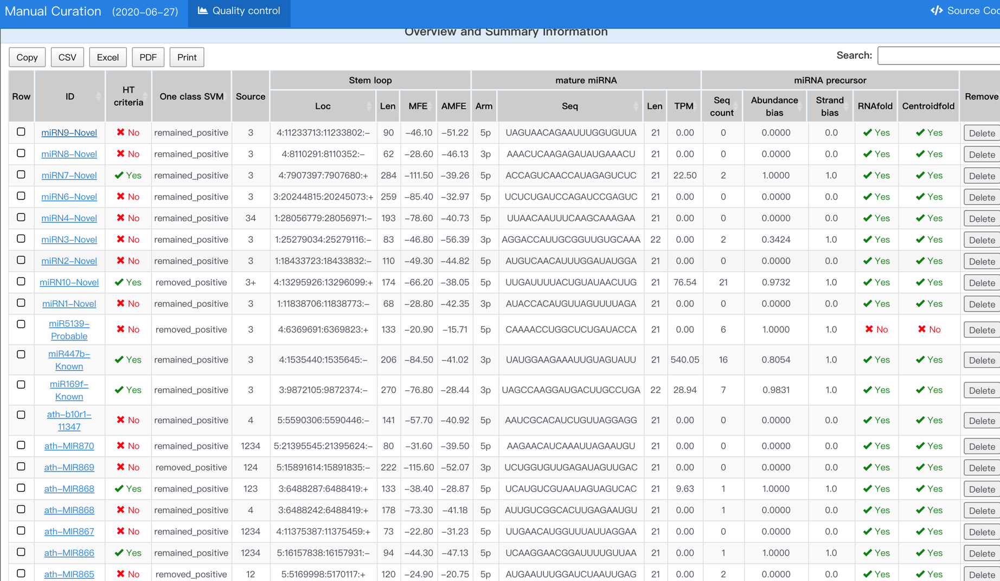

Each miRNA has a report page that contains detailed information customized by feature types, making it easy to understand this miRNA during manual curation. A secondary structure plot is generated to display the location of a mature miRNA within the precursor sequence and quality-profiling results. Read stacks are plotted to show the read support of identified miRNAs. A boxplot is used to visualize miRNA expression patterns and arm selection events across different samples. A bipartite network is constructed to depict miRNA-target interactions predicted by [psRNAtarget](http://plantgrn.noble.org/psRNATarget/). Users can quickly browse this miRNA and further decide which features make this miRNA candidate not actually a *bona fide* miRNA. The web server provides a complete preview of the results ([Output in manualCuration](https://deepngs.nwafu.edu.cn/static/welcome/testData/Test_results/III_manualCuration_output.html)).

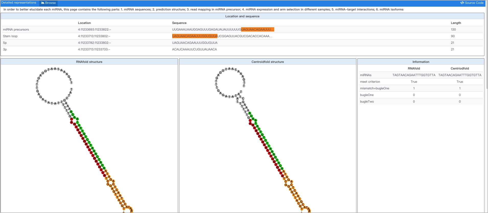

<p align="right"><a href="#top">&#x25B2; back to top</a></p>
